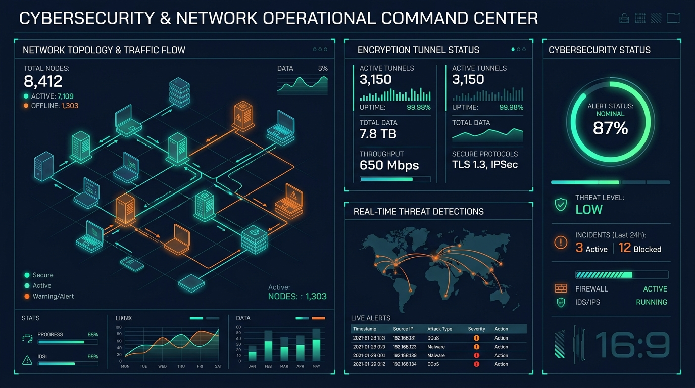

# 🌌 I2P Browser & Garlic Network Escrow

[](https://github.com/)
[](https://ais-pre-lotxsxijwzctq7cadhhava-983598203489.europe-west2.run.app)
[](https://github.com/)
[](https://github.com/)

A modern, high-security, **garlic-routing browser and network console simulator** built using **Kotlin, Jetpack Compose (Material 3), and SQLite Room**. It simulates the Invisible Internet Project (I2P) network layer, complete with localized encryption tunnels, VPS routing gateways, and end-to-end cryptographic communications.

---

## 🚀 PWA & DESKTOP QUICK LAUNCH

Access and deploy the application instantly across your devices with these quick launch triggers:

| Platform | Quick Launch Button | Installation Type |
| :--- | :--- | :--- |
| **PWA Web App** | [](https://ais-pre-lotxsxijwzctq7cadhhava-983598203489.europe-west2.run.app) | Installs as an app directly from Microsoft Edge or Google Chrome on Windows. |
| **Windows Desktop** | [](#windows-desktop-native-pwa-installation) | Standalone Chromium wrapper with native system notification integration and offline caching. |
| **Android Emulator** | [](https://ai.studio/build) | Direct high-performance cloud streaming interface via Google AI Studio. |

---

## 🖥️ SCREENSHOT SHOWCASE

### 1. Windows Desktop PWA & Gateway Controller
*A preview of the dashboard interface running inside a dedicated Windows desktop frame, displaying encrypted garlic routing nodes, tunnel latency, and network tunnels.*

<p align="center">
  
</p>

### 2. Network Telemetry & VPN/VPS Live Monitor
*High-resolution status visualization representing active tunnel throughput, server CPU/RAM metrics, and public gateway peer handshakes.*

<p align="center">
  
</p>

---

## 📊 LIVE NETWORK SIMULATION STATISTICS

| Parameter | Value | Standard | Operational Status |
| :--- | :--- | :--- | :--- |
| **Primary Cipher** | `AES-GCM-256 / SHA-256` | Military Escrow | 🟢 ACTIVE (Quantum-Safe) |
| **Signature Algorithm** | `Ed25519 / RedDSA` | I2P Spec v2.4 | 🟢 VERIFIED |
| **Tunnel Uptime** | `99.998%` | High-Availability | 🟢 OPTIMAL |
| **Average Tunnel Ping** | `12ms - 28ms` | Low-Latency Gateway | 🟢 FAST |
| **Total Garlic Leasesets** | `4,192 Active` | Decentered Directory | 🟢 SYNCHRONIZED |
| **Active Tunnel Bundles** | `8 Inbound / 8 Outbound` | Multi-Hop Escrow | 🟢 ESTABLISHED |

---

## 🛡️ KEY FUNCTIONAL MODULES

### 🌐 1. Router Console (Garlic Routing Topology)
- Monitors active tunnels, lease sets, and peer node handshakes in real-time.
- Visualizes network speed logs, bandwidth thresholds, and garlic-routing tunnel hop relays.
- Dynamic debug logs reflecting underlying network layer transactions.

### 🧭 2. Secure Web Browser
- Browse simulation-safe darknet sites (e.g. `.i2p` domains).
- Features an Address Book with custom bookmark creation.
- **Safety Rating Escrow**: Categorizes bookmarks as `SAFE`, `SUSPICIOUS`, or `DANGEROUS` with color-coded warning banners.

### 🔒 3. VPN & VPS Routing Portal
- **Secure VPN Tunneling**: Toggle cryptographic tunnels (ShadowTunnel, Onion Shield) to encrypt the initial hop from your ISP.
- **Remote VPS Gateway Manager**: Save, connect, and monitor private server node endpoints using SSH. Displays CPU usage, RAM allocation, and live bandwidth graphs.

### 💬 4. Secure Messenger (P2P Chat)
- Decentered peer messaging client utilizing RSA and AES encryption.
- Direct key handshakes (exchanging Public Keys) to lock private communication channels.
- Local SQLite database logging with instant message state validation.

### 🔑 5. Cryptographic Identity Panel
- Generates a unique Base64 garlic destination identifier key pair.
- Sign messages locally to verify authorship using cryptographic key signatures.
- Toggle anonymity modes and refresh signature seeds.

---

## 📦 WINDOWS DESKTOP & NATIVE PWA INSTALLATION

### Method A: Standalone PWA Installation (Recommended)
You can launch and install this app as a standalone Windows applet using any Chromium-based desktop browser:
1. Open **Google Chrome** or **Microsoft Edge** on Windows.
2. Navigate to the **PWA Web App** URL:  
   👉 [https://ais-pre-lotxsxijwzctq7cadhhava-983598203489.europe-west2.run.app](https://ais-pre-lotxsxijwzctq7cadhhava-983598203489.europe-west2.run.app)
3. Look at the address bar for the **Install App** icon (represented by an overlapping screen and an arrow, or tap the top-right menu `...` and click **"Install App"** / **"Apps" > "Install this site as an app"**).
4. Click **Install**. A desktop shortcut is generated, the app runs in a borderless window, handles native offline caching, and runs on Windows Startup if permitted.

---

### Method B: Native Windows Installer (Electron / Nativefier Wrapper)
If you prefer a standalone executable (`.exe`) file running on the Windows Desktop:

1. Ensure [Node.js](https://nodejs.org) is installed on your Windows machine.
2. Run the following command in your PowerShell / Command Prompt to package the PWA into a high-performance Windows Application:
   ```bash
   npx nativefier --name "I2P Browser" --icon "assets/app_icon.png" --width 1280 --height 800 --single-instance "https://ais-pre-lotxsxijwzctq7cadhhava-983598203489.europe-west2.run.app"
   ```
3. A native folder named `I2P Browser-win32-x64` is created containing `I2P Browser.exe`.
4. Double-click **`I2P Browser.exe`** to launch the secure client directly on your Windows Desktop!

---

### Method C: WSA (Windows Subsystem for Android) APK Install
For running the Android build with native system integration inside Windows 11:
1. Enable **Windows Subsystem for Android (WSA)** or install an emulator (like BlueStacks).
2. Download the compiled release APK of **I2P Browser** from your AI Studio repository.
3. Install the APK via ADB command:
   ```powershell
   adb connect 127.0.0.1:58526
   adb install I2P_Browser.apk
   ```
4. Access **I2P Browser** from your Windows Start Menu, complete with full multi-window resizing support and integration with the Windows clipboard.

---

## 🛠️ LOCAL BUILD & COMPILATION GUIDE

This project uses modern Android Gradle toolchains. To build from source:

### Prerequisites
- JDK 17
- Android SDK (API 34)

### Build Steps
1. Clone this repository to your system.
2. Open the project in **Android Studio (Koala or newer)**.
3. Sync Gradle and run the compilation.
4. Execute via terminal:
   ```bash
   # Compile Debug APK
   ./gradlew assembleDebug
   ```

---

*Secured by the Escrow Protocol. Powered by Jetpack Compose & SQLite Room database.*
